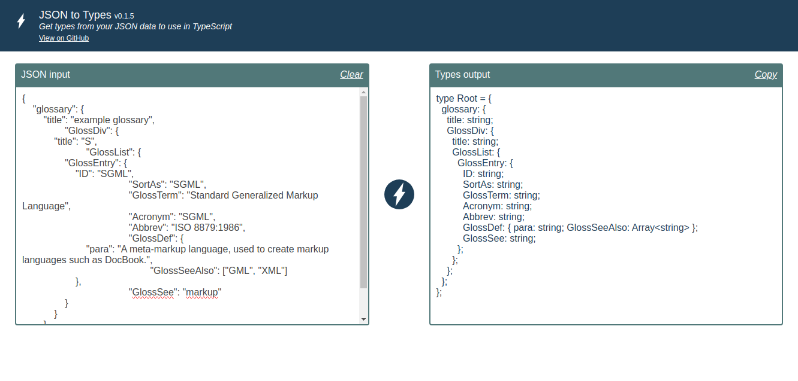

# JSON-TO-TYPES


Get types from your JSON data to use in TypeScript.

[https://eduhds.github.io/json-to-types/](https://eduhds.github.io/json-to-types/)



<!-- [Documentação](https://<username>.github.io/<repository>) -->

## Instalação

```sh
npm i json-to-types
yarn add json-to-types
pnpm add json-to-types
```

## Desenvolvimento

```sh
# Limpar outputs
pnpm run clean

# Compilar lib
pnpm run tsc

# Executar testes
pnpm run test

# Gerar documentação
pnpm run docs
```
